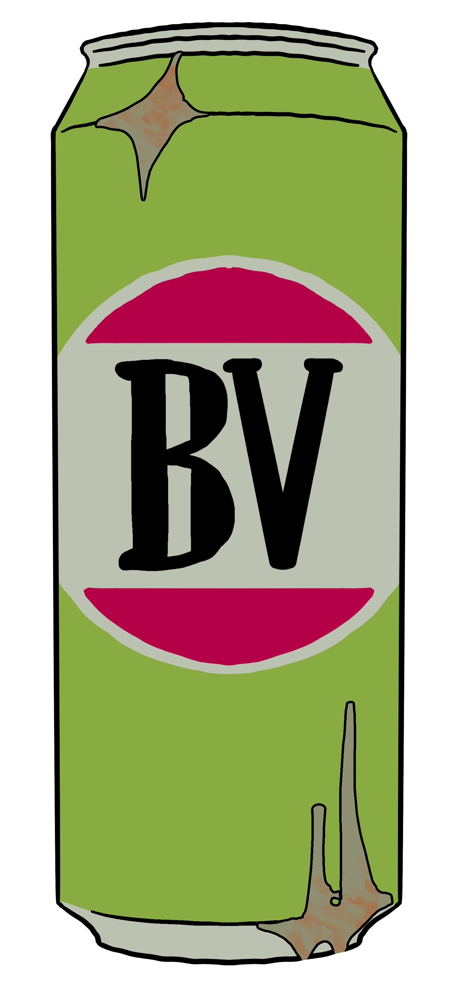

<!DOCTYPE html>
<html lang="en">
<head>
    <meta charset="UTF-8">
    <meta name="viewport" content="width=device-width, initial-scale=1.0">
    <link rel="stylesheet" href="Styles.Css">
    <title>Background Image Slideshow</title>
    
</head>
<body>
    

        

        <h1>Welcome to My Portfolio</h1>
        
 My name is Peyten Redburn and I am a 2nd year student studying a Bachelor of Games and Interactive Environments, with a major in Game Design at the Queensland University of Technology. 

        
 I specialise in gameplay design and level design, however I often have been known to branch out into the other key areas of the game design process including animation and programming areas.

        
 I have 4 Games currently that I have made with a 5th game under development in collaboration with the Awesome Women In Construction team.

        

        <footer>
            

                
                
                <a href="page3.html" title="Paperfell">
                    0
                </a>
                
            

        </footer>

    

</body>
</html>

